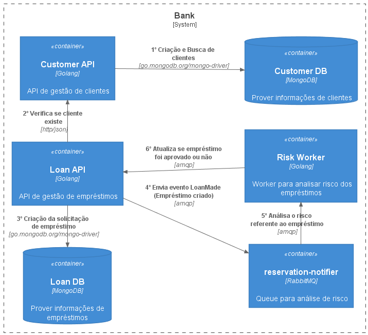

# Bank 
Projeto para simular empréstimos financeiros em um banco para clientes

## Tecnologias Utilizadas
1. [Golang](https://golang.org/)
2. [MongoDB](https://www.mongodb.com/)
3. [RabbitMQ](https://www.rabbitmq.com/getstarted.html)
4. [Github Actions](https://docs.github.com/pt/actions)
5. [Docker Hub](https://hub.docker.com/)
6. [Docker](https://www.docker.com/)
7. [Kubernetes](https://kubernetes.io/pt-br/)
8. [Minikube](https://minikube.sigs.k8s.io/docs/start/)

## Funcionalidades
1. Registrar cliente
2. Buscar cliente por documento
3. Solicitar empréstimo 
4. Aprovar/Reprovar empréstimos
5. Listar empréstimos de um cliente
   
## Desenho da Solução
<p align="center">
  
</p>

## Executar em ambiente local (Docker Compose)
1. Na raiz do projeto executar o seguinte comando: 
    ```
    docker-compose up -d 
    ```

## Executar em ambiente local (Minikube)
1. Instalando minikube (Windows)
   ```
   choco install minikube
   ```

2. Instalando kubernetes-cli (Windows)
   ```
   choco install kubernetes-cli
   ```

3. Para iniciar o ambiente minikube (local)
   ```
   minikube start
   ```

4. Para aplicar os manifestos do k8s 
   ```
   kubectl apply -f .\.k8s\metrics\ -R
   kubectl apply -f .\.k8s\namespaces\ -R
   kubectl apply -f .\.k8s\deployments\ -R -n bank
   kubectl apply -f .\.k8s\services\ -R -n bank
   kubectl apply -f .\.k8s\certmanager\ -R -n bank
   kubectl apply -f .\.k8s\ingress\ -R -n bank
   kubectl apply -f .\.k8s\hpas\ -R -n bank
   ```
   
5. Habilitar dashboard kubernetes 
   ```
   minikube dashboard
   minikube tunnel
   ```

6. Habilitar portas dos serviços para utilizar localmente
   ```
   minikube service mongodb-service -n bank
   minikube service rabbitmq-service -n bank
   minikube service customer-api-service -n bank
   minikube service loan-api-service -n bank
   ```

7. Alternando entre contextos 
   ```
   kubectl config get-contexts
   kubectl config use-context (nome do contexto)
   ```

8. Listando pods
   ```
   kubectl get pods -n bank
   ```
   
9. Listando services
   ```
   kubectl get svc -n bank
   ```

11. Listando hpa (HorizontalPodAutoscaler)
    ```
    kubectl get hpa -n bank
    ```
## Microsoft Azure (AKS)
1. Autenticação no azure (Precisamos instalar o ([Azure CLI](https://docs.microsoft.com/pt-br/cli/azure/install-azure-cli))
   ```
   az login
   ```
2. Obtendo credenciais do cluster AKS 
   ```
   az aks get-credentials --resource-group $RESOURCE_GROUP --name $NAME
   ```
3. Instalando nginx ([Nginx](https://kubernetes.github.io/ingress-nginx/deploy/))
   ```
   kubectl apply -f https://raw.githubusercontent.com/kubernetes/ingress-nginx/controller-v1.0.0/deploy/static/provider/cloud/deploy.yaml
   ```
4. Instalando cert-manager ([Cert-Manager](https://cert-manager.io/docs/installation/))
   ```
   kubectl apply -f https://github.com/jetstack/cert-manager/releases/download/v1.5.3/cert-manager.yaml
   ```

## Habilitando Istio 
1. Instalando istio
   ```
   istioctl install --set profile=demo -y
   ```
2. Habilitando no namespace
   ```
   kubectl label namespace <namespace> istio-injection=enabled
   ```
3. Habilitando Prometheus
   ```
   kubectl apply -f https://raw.githubusercontent.com/istio/istio/release-1.11/samples/addons/prometheus.yaml
   ```
4. Habilitando Grafana
   ```
   kubectl apply -f https://raw.githubusercontent.com/istio/istio/release-1.11/samples/addons/grafana.yaml
   ```
5. Habilitando Kiali
   ```
   kubectl apply -f https://raw.githubusercontent.com/istio/istio/release-1.11/samples/addons/kiali.yaml
   istioctl dashboard kiali
   ```

## Executar teste de carga (Artillery.io)
1. Executando o teste de carga 
   ```
   artillery run -o artillery-report.json artillery.yaml
   ```